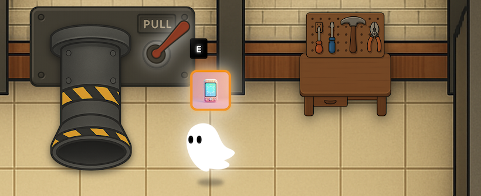
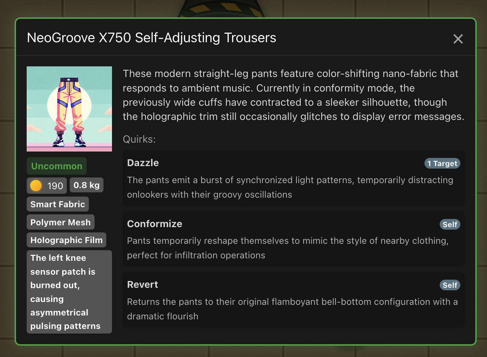
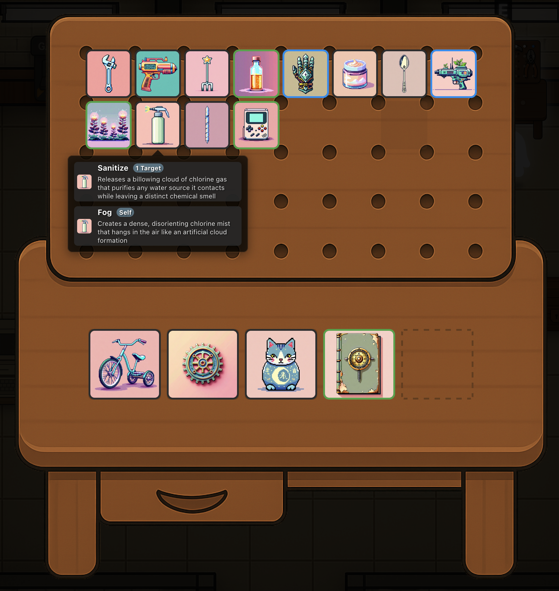
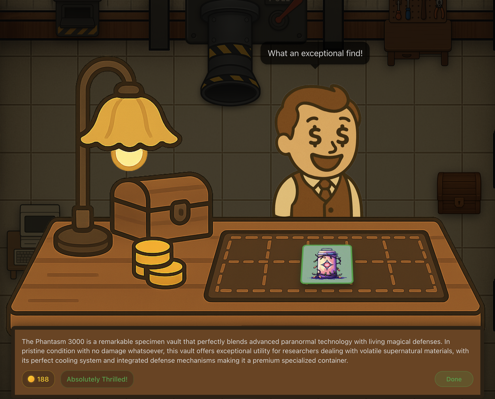

## PlaceholderTitle

This is an infinite crafting workshop game developed as a demo project for Kiro. >95% of the code has been written by prompting Kiro. This demo project is
designed to show best practices for Kiro, and AI engineering
in general.

## Find Unique Items

Every generated item is unique. Experience an infinite range of potential: from mundane pieces of garbage, to celestial remnants of epic value.

Each item has its own unique description, damage, and quirks.

## Craft and Improve

The items you obtain aren't static. Add an item to the workbench to use it's quirks on other items. Cut, smash, and break items down into components. Glue, weld, or install items together into complex configurations. Paint, cook, or enchant items to modify their appearances and effects.

If there is a verb for it, you can probably do it in this game!

## Sell

Done with an item, or just need to make some space in your inventory?

The appraiser will analyze your item, and sell it for you, giving you a cut of what it was worth!

## Developer Resources

### Start Here

* [local-setup.md](./docs/local-setup.md) - Instructions for how to deploy a local version of the game for fun, or for development

### Learn More

* [CHALLENGE.md](./docs/CHALLENGE.md) - This game has a sample branch that is deliberately left unfinished, with a few bugs. Read to learn more about these tasks. You can use Kiro to work on these tasks.
* [ROADMAP.md](./docs/ROADMAP.md) - There is always more ideas to build. Although this game has a basic core loop, there is a lot more depth that can be added. Kiro is a great tool to implement these remaining features.
* [architecture.md](./docs/architecture.md) - Learn more about how the game works, and how it's pieces tie together.
* [appsec-overview.md](./docs/appsec-overview.md) - Similar to the architecture overview, but more focused on the inbound and outbound connection security.
* [server-messages.md](./docs/server-messages.md) - Documentation of all WebSocket message types and their formats used for client-server communication.
* [client-events.md](./docs/client-events.md) - Documentation of all client-side events and their payloads used for internal game communication.
* [remote-deploy.md](./docs/remote-deploy.md) - Instructions for how to deploy the game as a publically hosted service on AWS infrastructure.
* [guiding-principles.md](./docs/guiding-principles.md) - Some of the guiding principles of the project.

### Contributions

The core game loop of this demo project is complete, however, there is
also a roadmap of potential ideas that could be built into this game.
Check the [ROADMAP.md](./docs/ROADMAP.md) for ideas on what you might be
able to build into the game. 

Open source contributions are welcome. See [CONTRIBUTING.md](CONTRIBUTING.md)
for instructions on how to contribute.

## Security

See [CONTRIBUTING](CONTRIBUTING.md#security-issue-notifications) for more information.

## License

This library is licensed under the MIT-0 License. See the LICENSE file.

