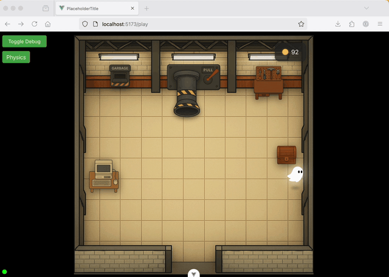

# Challenge Tasks

This project has a few bugs and feature gaps that were
deliberately left behind so you could experiment with AI
engineering.

## Challenge 1: Weak home page

See if you can get the coding agent to explore the codebase,
figure out the game's features and selling points, and
create a better home page for the game.

__Tip:__ Try out different styles such as: "Apple product marketing page",
"Retro", or "Startup" and/or ask for specific things that you want like a
"carousel", "quotes", or "animations".

## Challenge 2: Physics bug

If you have items in an active physics state (such as the
player character actively moving, and colliding with an object)
then if you tab out of the game, wait a few seconds, and tab
back in, you will see the items do a tremendous bounce!

Easy reproduction is to pull the lever, switch browser tabs while the
item is generated so that the item is dispensed while the
tab is backgrounded, then switch back to the game tab. 

Can AI figure out the cause of this bug and then fix it?

_Extra credit: There are multiple potential solutions to this problem. Be sure to ask the AI to dig deeper and suggest alternate solutions. Think about the various potential solutions, and use your strengths as a human to select the right one(s)._

## Challenge 3: Interactions bug

Sometimes when the player is closer to the wall than to an interactive object like an item or the chest, then the interact prompt does not appear over the interactive object.

Can you fix this using AI?

## Challenge 4: Sounds

The game currently has no sounds. Can you add a sound system to the game?
There is a list of royalty free, no attribution required sounds available here:
https://sonniss.com/gameaudiogdc/
Consider how to load a list of background and interaction sounds, then trigger
these sounds to play via events that are emitted from all relevant components.

## Challenge 5: Implement email verification, then password reset

This application uses Amazon Cognito. Cognito requires emails to be verified in order to use them as a password reset option.

Currently the application just uses an admin method to verify user accounts
without verfiying the user's email. This means that password resets
can't be implemented. 

Can you implement email verification, then implement password reset across the client
and the backend server?

