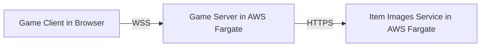
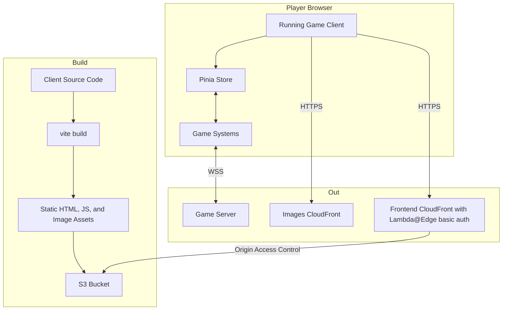
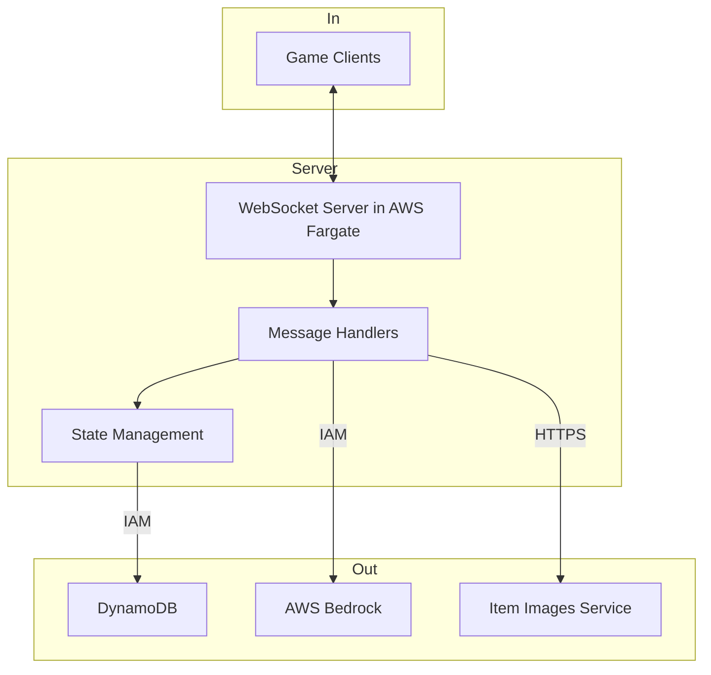
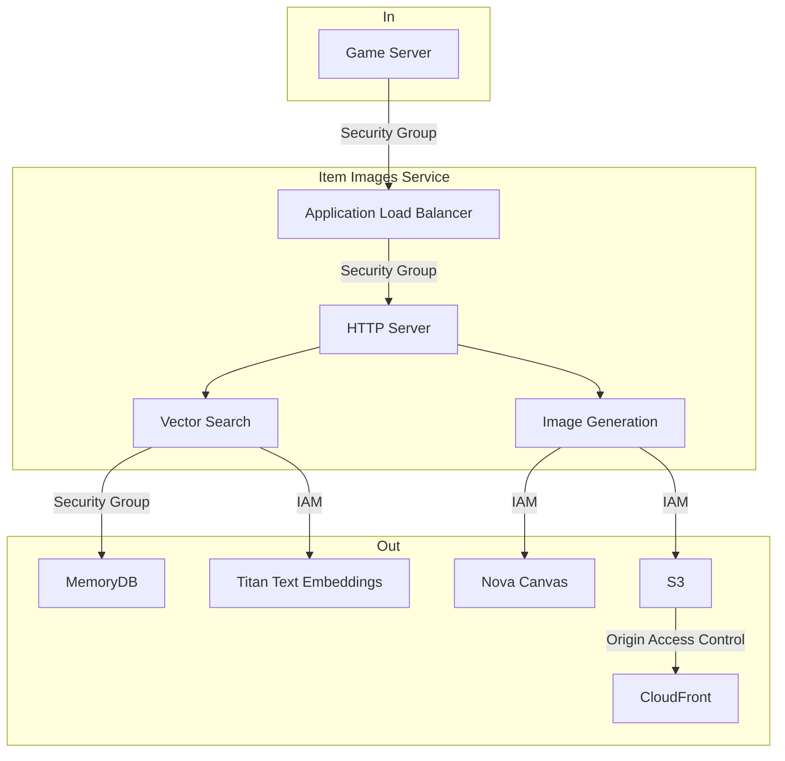

# Application Security and Architecture Documentation

High level overview of the components and how they talk to each other:

## Game Client

The Game Client is a Vue.js 3 single page application that provides the user interface and game experience in the user's browser. It maintains real-time state synchronization with the server through a WebSocket connection to the game server.

### Technology Stack
- **Framework**: Vue.js 3 with Composition API
- **Build Tool**: Vite
- **Language**: TypeScript
- **State Management**: Pinia
- **Routing**: Vue Router
- **Hosting**: S3, accessed via CloudFront

The game client is built using Vite, and hosted as static HTML, JS, CSS, and image assets in an S3 bucket. Browsers fetch from the S3 bucket via CloudFront.

### Inbound Connections
- The player's browser loads the game client as static prebuilt assets delivered by CloudFront, using the S3 bucket as an origin. CloudFront uses an Origin Access Control policy to fetch from the S3 bucket. In preview, CloudFront also has a Lambda@Edge function that implements HTTP basic auth to restrict public access.

### Outbound Connections
- Browser running client connects via WSS to a WebSocket based game server via CloudFront in order to sync various forms of state:
  - Authentication (signin/signup)
  - Item operations (pull, move, discard, appraise, buy)
  - Inventory queries and synchronization
  - Periodic ping/pong for connection health
-  Browser running client connects via HTTPS to a CloudFront distribution that hosts dynamically generated item images
-  Browser running client connects via HTTPS to it's own CloudFront distribution to load in additional static, prebuilt assets in the background as the user accesses new screens

## Game Server

The Game Server is a Bun-based WebSocket server that manages game state, player authentication, and coordinates interactions between clients and external services. It uses DynamoDB for persistent storage and integrates with AWS Bedrock for AI-powered item generation. It calls a downstream image generation service that creates dynamic images for game items.

### Technology Stack
- **Runtime**: Bun
- **Language**: TypeScript
- **WebSocket**: Native Bun WebSocket server
- **Database**: Amazon DynamoDB
- **Hosting:** AWS Fargate, orchestrated by Amazon ECS
- **AI Services**: AWS Bedrock

### Inbound Connections
- WebSocket connections from Game Clients, via **CloudFront**

### Outbound Connections
1. The game server persists data in **DynamoDB**. The game server uses an ECS task IAM role to grant it permissions to communicate with the following tables:
   - `Users` Table: User account metadata
   - `Usernames` Table: Maps usernames to user ID's
   - `Items` Table: Game item metadata
   - `Inventory` Table: Inventory ID to item mapping
   - `Location` Table: Item ID to inventory ID mapping
   - `Persona` Table: Metadata about player characters

2. The game server requests image URL's from **Item Images Service**
   - HTTPS requests to Application Load Balancer fronting the server
   - Simple REST server that returns a JSON response

3. The game server uses **AWS Bedrock**
   - The game server uses an ECS task IAM role to grant it permissions to make Bedrock API calls.
   - LLM is used to generate new items, model dynamic interactions between items, and appraise items for sale.
   - Server implements and retry and fallback through the following models, in order: Anthropic Sonnet 4, Anthropic Sonnet 3.7, and Amazon Nova Pro

## Item Images Service

The Item Images Service is a specialized microservice that handles the generation, storage, and retrieval of game item images. It uses vector search capabilities with MemoryDB to index and lookup similar images as a cost savings measure. It uses Amazon Nova Canvas to generate images, stores the images in S3, and serves them via CloudFront.

### Technology Stack
- **Runtime**: Bun
- **Language**: TypeScript
- **Hosting:** AWS Fargate, orchestrated by Amazon ECS
- **Database**: AWS MemoryDB (Redis-compatible)
- **Storage**: Amazon S3
- **CDN**: CloudFront
- **AI Services**: 
  - Amazon Titan Text Embeddings v2
  - Amazon Nova Canvas

### Inbound Connections

- HTTPS requests from Game Server for image generation. Requests ingress via an HTTPS Application Load Balancer, and are distributed across Bun containers hosted in AWS Fargate.

### Outbound Connections
1. **MemoryDB**
   - Vector database to search for similar generated images
   - MemoryDB has a security group that only allows inbound connections
     from the security group of this service.

2. **S3**
   - Storage for generated images
   - Item images service has an IAM role that grants it permission to
     add items to the S3 bucket
   - No public ACL, CloudFront accesses the bucket via ab Origin Access Control policy.

4. **AI Services**
   - Titan Text Embeddings for embeddings that can be stored in vector database
   - Nova Canvas for image generation
   - Item images service has an IAM role that grants it permission to talk to Bedrock

