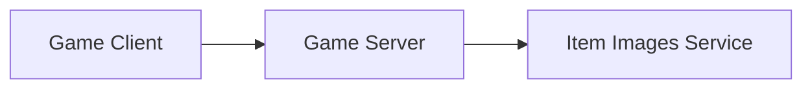
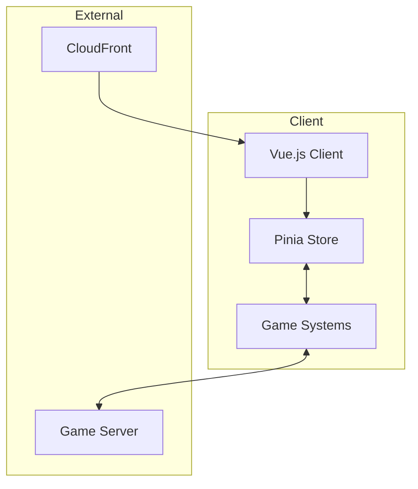
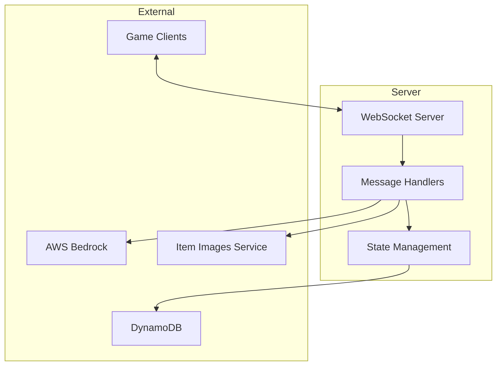
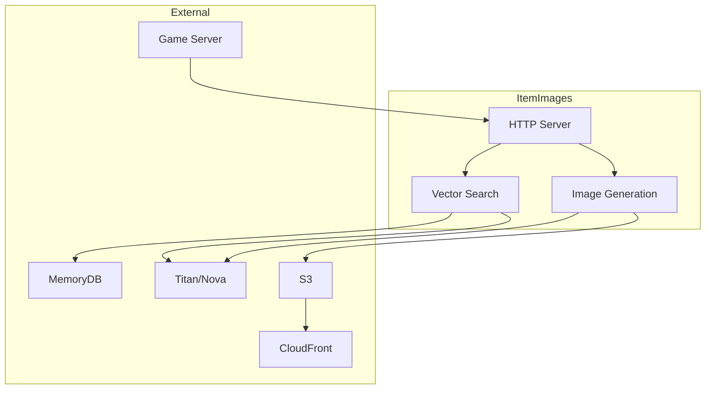

# Application Security and Architecture Documentation

## Game Client

The Game Client is a Vue.js 3 single page application that provides the user interface and game experience in the user's browser. It maintains real-time state synchronization with the server through a WebSocket connection to the game server.

### Technology Stack
- **Framework**: Vue.js 3 with Composition API
- **Build Tool**: Vite
- **Language**: TypeScript
- **State Management**: Pinia
- **Routing**: Vue Router

### Inbound Connections
- WebSocket connection from Game Server for real-time updates
- HTTP connection from CloudFront for static assets and images

### Outbound Connections
- WebSocket connection to Game Server for:
  - Authentication (signin/signup)
  - Item operations (pull, move, discard)
  - Inventory management
  - Game state synchronization
  - Periodic ping/pong for connection health

## Game Server

The Game Server is a Bun-based WebSocket server that manages game state, player authentication, and coordinates interactions between clients and external services. It uses DynamoDB for persistent storage and integrates with AWS Bedrock for AI-powered item generation. It calls a downstream image generation service that creates dynamic images for game items.

### Technology Stack
- **Runtime**: Bun
- **Language**: TypeScript
- **WebSocket**: Native Bun WebSocket server
- **Database**: Amazon DynamoDB
- **AI Services**: AWS Bedrock (for item generation)

### Inbound Connections
- WebSocket connections from Game Clients
- HTTP connections from Item Images Service for image generation

### Outbound Connections
1. **DynamoDB**
   - Users Table: User account management
   - Usernames Table: Username uniqueness
   - Items Table: Game item metadata
   - Inventory Table: Item ownership
   - Location Table: Item placement
   - Persona Table: Player character data

2. **Item Images Service**
   - HTTP requests for image generation
   - Image metadata retrieval

3. **AWS Bedrock**
   - AI-powered item generation
   - Story generation for items

## Item Images Service

The Item Images Service is a specialized microservice that handles the generation, storage, and retrieval of game item images. It uses vector search capabilities with MemoryDB to index and lookup similar images as a cost savings measure. It uses Amazon Nova Canvas to generate images, stores the images in S3, and serves them via CloudFront.

### Technology Stack
- **Runtime**: Bun
- **Language**: TypeScript
- **Database**: AWS MemoryDB (Redis-compatible)
- **Storage**: Amazon S3
- **CDN**: CloudFront
- **AI Services**: 
  - Amazon Titan Text Embeddings v2
  - Amazon Nova Canvas

### Inbound Connections
- HTTP requests from Game Server for image generation
- CloudFront requests for image delivery

### Outbound Connections
1. **MemoryDB**
   - Vector storage for image search
   - Image metadata caching
   - Search query processing

2. **S3**
   - Image storage
   - Metadata storage

3. **CloudFront**
   - Image delivery to clients
   - Content caching

4. **AI Services**
   - Titan Text Embeddings for vector generation
   - Nova Canvas for image generation

