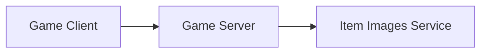
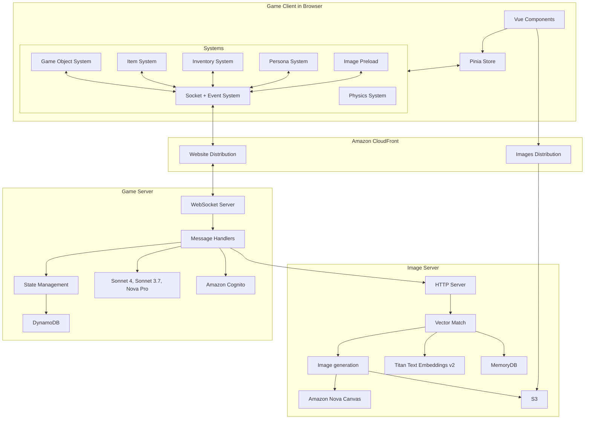

# AI Scrapyard Game Documentation

This game uses a client server architecture. There are three main components:

## Game Client:
  * Vue.js based game engine which represents game objects as
    Vue components.
  * Flexible tile grid system that adapts to varying screen sizes
  * Interactive game objects (dispenser, workbench, garbage, storage chest, computer)
  * Physics-based movement and collision system
  
## Game Server:
  * WebSocket protocol for low latency bi-directional communication between client and server
  * DynamoDB storage of inventories and item metadata.
  * AWS Bedrock integration powering the following features:
     * Random item generation. Infinite variations of items. Unique item names,
       descriptions, damage, and skills, written by generative AI.
     * Crafting. Transform, improve, combine, and consume items in a
       realistic manner.
     * Appraisal. Sell your crafted items to see what the AI thinks
       they are worth.
  * Amazon Cognito integration for user authentication and authorization
  
## Item Images Server:
  * AWS Bedrock integration powering the following features:
    * Amazon Nova Canvas to generate unique images for generated items
    * Amazon Titan Text Embeddings v2 to generate vector embeddings of item descriptions
  * Amazon MemoryDB vector database to do vector matching of previously generated item images to new item image requests
  * S3 to store item images, CloudFront distribution as ingress.

## Architecture Map

The following map shows the relationships and data flow through the end to end architecture:

## Frontend Game Client Systems

The client is built with Vue.js 3 and uses the Composition API throughout. The architecture follows these key patterns:

- **Component-based UI**: Vue components for all game UI elements
- **System-based Architecture**: Game logic is separated into independent systems that engage with each other through events.
- **Reactive State Management**: Using Pinia and Vue's reactivity system
- **Server-driven Events**: WebSocket events from the server feed into the frontend event system to drive game state changes

### Socket System
- Manages connection to the WebSocket server, including reconnection on disconnect
- Provides methods to dispatch WebSocket messages to the server.
- On incoming message from the server, fans that message out to other systems
  that are subscribing to that message.

### Game Object System
- Tracks all game objects that are drawn on screen
- Handles object creation, updates, and removal

### Physics System
- Handles all physics calculations and collision detection for game objects, including object movement, collisions, and gravity
- Supports different types of physics interactions (static, dynamic, field)
- Implements bounce, friction, and mass-based interactions

### Item System
- Keeps track of all game items and their properties
- Synchronizes with server state via event subscriptions

### Inventory System
- Keeps track of which inventory an item is in
- Handles item pickup, drop, and transfer
- Synchronizes with server state via event subscriptions

### Persona System
- Manages player personas and character data
- Handles persona customization and state
- Synchronizes with server state via event subscriptions

### Preloader System
- Manages asset loading and initialization
- Tracks loading progress
- Uses event subscription to watch for new images to load

## Server Architecture

The server is a Bun-based WebSocket server that handles:

- Real-time game state synchronization
- Message-based communication
- AI integration for item generation
- State persistence using AWS services

## Infrastructure

The game uses AWS services for:

- CloudFront distribution
- S3 storage for AI-generated images
- DynamoDB for state persistence
- Bedrock for AI integration

## Development

The project uses Docker for local development with separate containers for:
- Client (Vue.js application)
- Server (Bun WebSocket server)
- Infrastructure deployment
