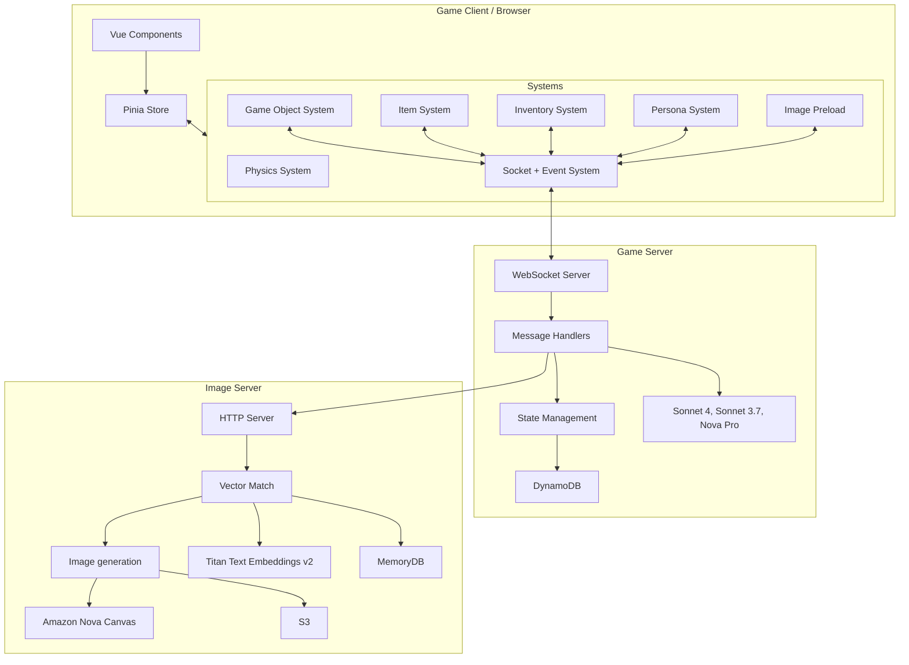

# AI Scrapyard Game Documentation

## Architecture Overview

AI Scrapyard follows a client-server architecture. The client connects
to a backend game server, which makes use of a specialized item image generation service.

## Frontend Game Client Systems

The client is built with Vue.js 3 and uses the Composition API throughout. The architecture follows these key patterns:

- **Component-based UI**: Vue components for all game UI elements
- **System-based Architecture**: Game logic is separated into independent systems
- **Reactive State Management**: Using Pinia and Vue's reactivity system
- **Event-driven Communication**: WebSocket events drive game state changes

### Physics System
- Handles all physics calculations and collision detection
- Manages object movement, collisions, and gravity
- Supports different physics types (static, dynamic, field)
- Implements bounce, friction, and mass-based interactions

### Socket System
- Manages WebSocket communication with the server
- Handles real-time game state synchronization
- Manages authentication and connection state

### Game Object System
- Tracks all game objects and their properties
- Renders game objects as Vue components
- Handles object creation, updates, and removal
- Integrates with physics system for object movement

### Item System
- Keeps track of all game items and their properties
- Handles item interactions and state
- Synchronizes with server state

### Inventory System
- Keeps track of which inventory an item is in
- Handles item pickup, drop, and transfer
- Synchronizes with server state

### Persona System
- Manages player personas and character data
- Handles persona customization and state
- Synchronizes with server state

### Preloader System
- Manages asset loading and initialization
- Tracks loading progress
- Handles error states during loading

## Server Architecture

The server is a Bun-based WebSocket server that handles:

- Real-time game state synchronization
- Message-based communication
- AI integration for item generation
- State persistence using AWS services

## Infrastructure

The game uses AWS services for:

- CloudFront distribution
- S3 storage for AI-generated images
- DynamoDB for state persistence
- Bedrock for AI integration

## Development

The project uses Docker for local development with separate containers for:
- Client (Vue.js application)
- Server (Bun WebSocket server)
- Infrastructure deployment
